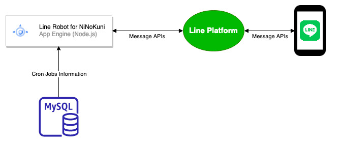

# Line Bot for NiNoKuni
In order to play the mobile game "Ni No Kuni" more convenient, I try to create a LINE bot which can inform regular activity events to everyone who are in the specific LINE channel. 

## Architecture

## Features
- [x] Set/Get regular events to/from MySQL database and notify people in LINE group chat.
- [ ] To know whom the magic books belong to this week. 
- [ ] Implement cron jobs list/add/edit/delete API.
- [ ] Edit regular events in React web page.
- [ ] Edit magic book queue in React web page.

## RESTful APIs
To be continue...
